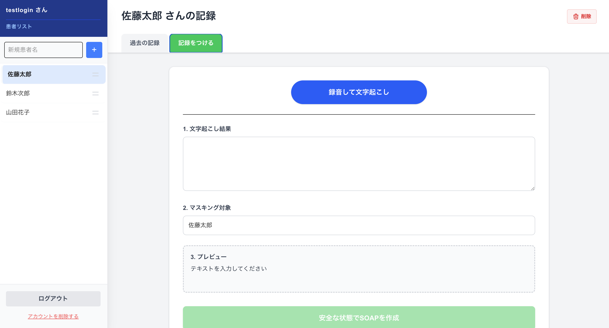
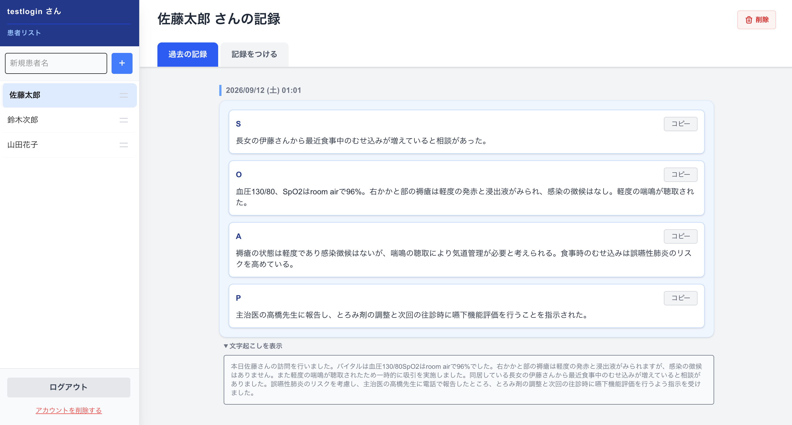
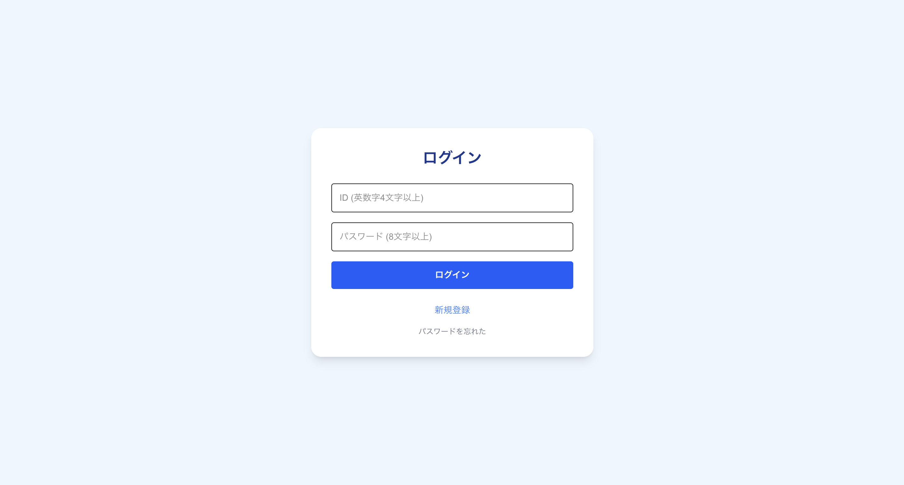

# 訪問看護師向け AI音声カルテ作成アプリ

## 概要
訪問看護師である母の業務負担を軽減するため、音声入力から自動で看護記録（S:主観的情報、O:客観的情報、A:評価、P:計画）を生成するWebアプリケーションです。
医療現場での使用を想定し、**「患者の個人情報をAIに送信する前にローカルでマスキングする機能」** や、**「忙しい現場でも片手で操作できるモバイル最適化（iOS Safari対応）」** にこだわって開発しました。

## 使用技術
* **フロントエンド:** Next.js (React), Tailwind CSS, TypeScript
* **バックエンド:** FastAPI (Python), SQLAlchemy, SQLite
* **AI / NLP:** 
  * AmiVoice API - 医療特化の音声文字起こし
  * GiNZA (spaCy) - 自然言語処理による個人情報の自動抽出・マスキング
  * OpenAI API (GPT-4o-mini) - SOAP生成
* **インフラ:** AWS (lightsail), PM2

## 主な機能
* **医療特化の文字起こし:** AmiVoice APIを使用し、専門用語を高精度にテキスト化。
* **個人情報の自動マスキング:** GiNZAを利用し、患者名を「対象者A」等に変換してからLLMに送信する安心・安全設計。
* **SOAP自動生成:** マスキングされたテキストからLLMがSOAP形式で要約し、画面側で元の名前に復号。
* **モバイル最適化UI:** iOS Safari特有の挙動（100vh問題、GPUレンダリングバグ、キーボードによるスクロールズレ）を制御したPWAライクな操作性。
* **直感的な患者管理:** ドラッグ＆ドロップ（タッチ対応）による患者リストの並び替え。

## インフラ構成・工夫点
* メモリ容量の限られたAWS環境において、スワップメモリの割り当てとプロセス管理（PM2）を行い、OOM Killerによるクラッシュを防止。安定稼働を実現しています。

## アプリのURL
https://13-193-223-240.nip.io/

**【テスト用ログインアカウント】**
すぐにアプリの動作をご確認いただけるよう、テストアカウントをご用意しております。
- メールアドレス: `testlogin`
- パスワード: `password123`
- 秘密の言葉: `りんご`(パスワード再設定用)

## 開発で最も苦労した点と技術的工夫

### 1. 医療情報の保護と、複数人が登場する会話のマスキング
* **課題**
  訪問看護の音声入力では、患者本人だけでなく「ご家族」や「担当医師」など複数人の個人名が頻繁に登場します。これらの機密情報をそのままクラウドのLLM（OpenAI API）へ送信することはセキュリティ上許容されません。しかし、単純な文字列置換では「誰が誰の発言をしたか」という文脈が破壊されてしまい、正確なカルテが生成できないというジレンマがありました。
* **処理内容**
  テキストをLLMへ送信する前の段階で、バックエンドにて自然言語処理モデルを用いた固有表現抽出を実行。「田中さん」「鈴木先生」などの人名を検知し、出現した人物ごとに「対象者A」「対象者B」へと一意に変換する処理を構築しました。LLMにはこのマスキング済みのテキストのみを渡し、SOAPが生成されてフロントエンドに返ってきたタイミングで、元の名前に復号して画面に表示させています。
* **この手法を選んだ理由**
  正規表現では自然な会話の揺らぎに対応できず、外部の匿名化APIを使うとそもそも外部に一度データを送るという矛盾が生じます。そのため、自社サーバー内で完全にオフライン処理ができる日本語特化型のNLPライブラリGiNZA (spaCy)を採用することが、情報漏洩リスクをゼロにしつつ、カルテの文脈を保持できる最適解だと判断しました。

### 2. 現場のスマホとオフィスPCを繋ぐWebアプリ化と、iPhone画面を活かしたUI設計
* **課題**
  訪問看護の実際の業務フローは、現場や移動中に記録を取り、後から家や事業所のパソコンを使って正式なカルテシステムに入力するというデバイスを跨いだ作業になります。また、現場で記録に使うiPhoneは画面が小さいため、必要な機能をすべて配置すると画面が煩雑になり、操作性が著しく低下してしまうという課題がありました。
* **処理内容**
  小さな画面でも見やすさと操作性を両立させるため、サイドバーを効果的に活用したUIを実装しました。患者一覧の切り替えや各種設定などのメニューはサイドバーに格納して必要な時だけ引き出せるようにし、メインとなる「音声録音」や「生成されたSOAPの確認」の画面領域を最大限広く確保しています。
* **この手法を選んだ理由**
  スマホ専用のネイティブアプリではなくWebアプリを選択した最大の理由は、現場のiPhone（録音）とオフィスのPC（カルテ転記）の両方から、ブラウザ経由でシームレスに同じデータへアクセスできる利便性が不可欠だったためです。また、限られた画面スペースに情報を詰め込むのではなくサイドバーに整理することで、忙しい現場でも直感的に見やすいレイアウトを実現しました。